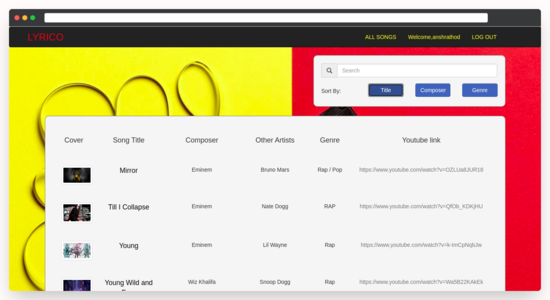

# LYRICO

[](https://www.python.org/) [](#)

**LYRICO** is a public website hosted using Github where any individual can access information such as lyrics, audio, and video pertaining to various songs added by unknown artists and fans.<br>
It is a collaborative platform targeted towards ardent music lovers and budding artists that are not associated with a major music label. It was developed with the aim of providing a free hosting service and to promote various musicians around the world.

### Project link:

[https://rathosansh.pythonanywhere.com](http://rathosansh.pythonanywhere.com)

## Tech

Lyrico uses a number of open source projects to work properly:

| Framework/Tech                               | Decription                                                                                                                                                                                          |
| -------------------------------------------- | --------------------------------------------------------------------------------------------------------------------------------------------------------------------------------------------------- |
| **[Python](https://www.python.org/)**        | _Python is an interpreted, high-level and general-purpose programming language._                                                                                                                    |
| **[Django](https://www.djangoproject.com/)** | _Django is a Python-based free and open-source web framework that follows the model-template-views architectural pattern._                                                                          |
| **[Pillow](https://pillow.readthedocs.io/)** | _Python Imaging Library is a free and open-source additional library for the Python programming language that adds support for opening, manipulating, and saving many different image file formats_ |
| **[SQLite](https://www.sqlite.org/)**        | _SQLite is a relational database management system contained in a C library._                                                                                                                       |

## Screenshots:

  

## Features:

- A decentralised approach to reading lyrics, listening to music, and watching videos on the same page.
- Provides a platform for budding artists to showcase their work.
- Provides a platform for music lovers to add their favourite pieces and songs.

## Steps To Install:

```sh
  Install Python v3.x
  cd to the root folder
  pip install -r requirements.txt
  Execute python manage.py runserver
  Open any browser @localhost:8000
```

## Special Thanks:

- [Anay Kulkarni](https://github.com/Anay121)
- [Karan Sheth](https://github.com/Korusuke)  
  Thank you for helping me with this project, and sticking with me through the buggiest of times!

## Pull requests welcome!

Spotted an error? Something doesn't make sense? Send me a pull request!
Thanks!

#### MIT © [Ansh Rathod](https://github.com/anshrathod)
